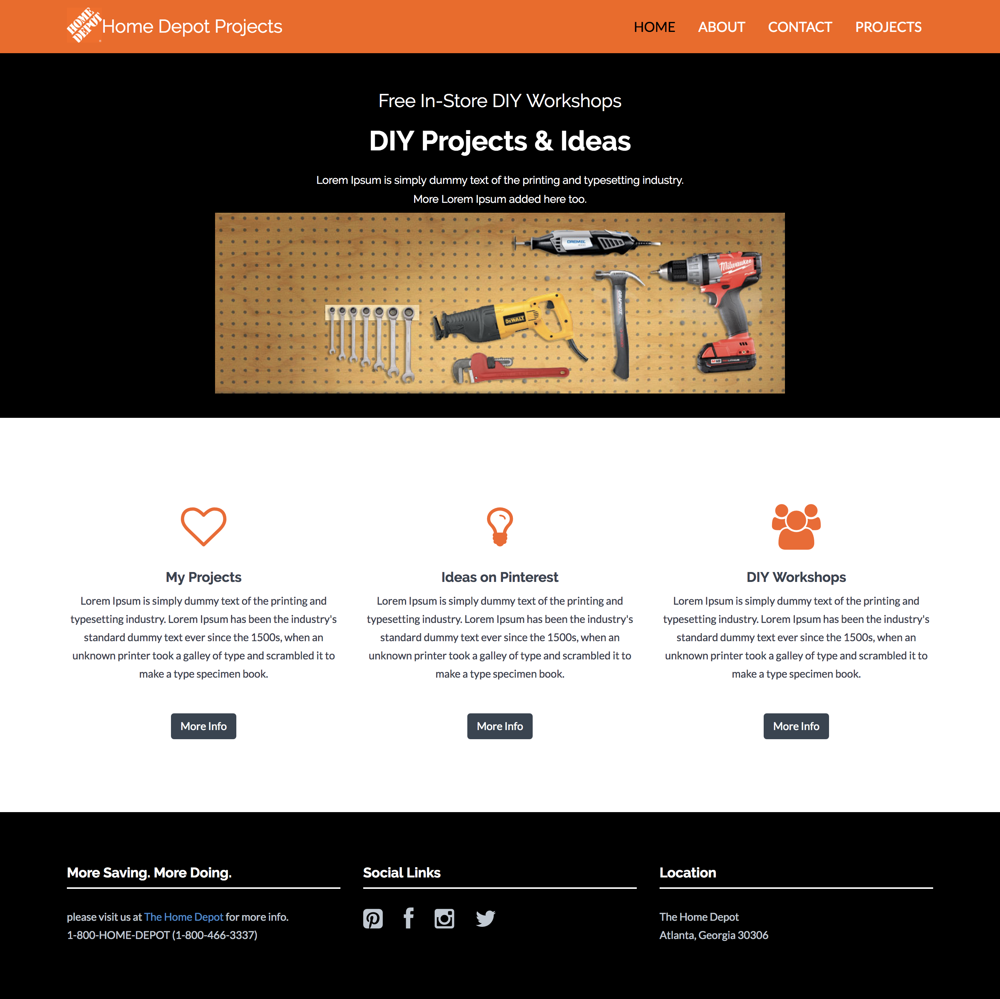

# Home Improvement Project Tracker

[Live Demo]( https://mccleary.github.io/Project-Tracker)

This is a Home Improvement Project Tracking app that I am working on.
I wanted somewhere to store and track the improvements and upgrades that I have completed and as well as my Wish List projects all in one place. I will be using the MEAN stack for this project.

** Still working on and adding MongoDB backend **

